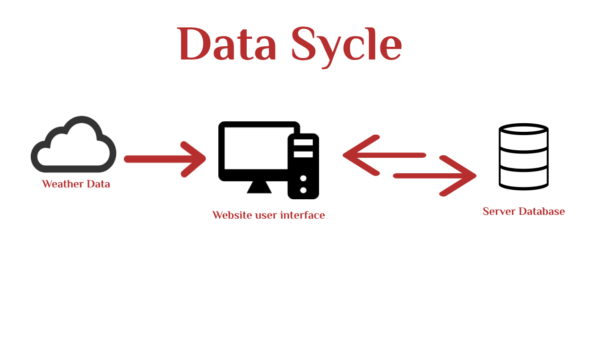

# Weather Journal App

## Overview
This project let user create a journal post with his input and attach the weather data by searching by city or state zip code. it provide a nice user interface to interact and use weather data

## Instructions
to use this app you need to run `server.js` in a nodejs environment by calling npm start than head to localhost:3000 in your browser to use the website.

## Dependencies
This website is developed using Node js, Express and backed by Open Weather API.

## Author
This application is made by Mariya Al Mamariya (c) 2023.